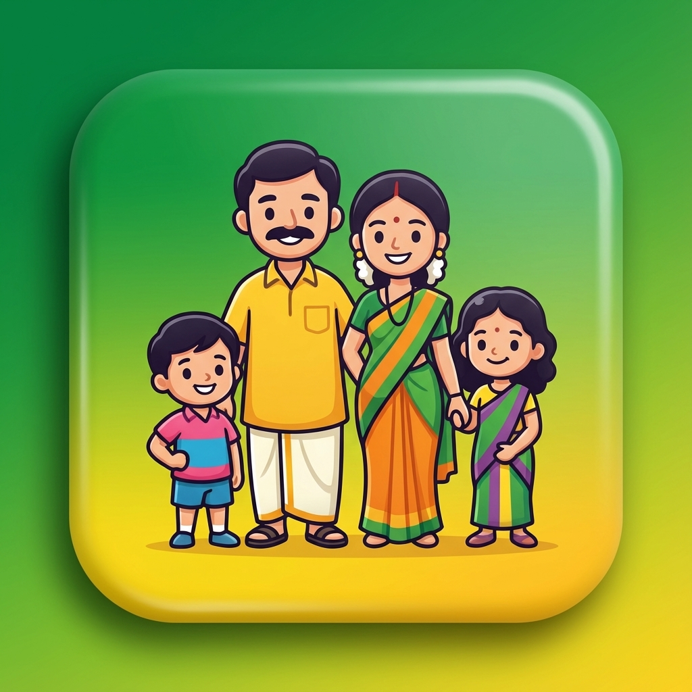

  
  
  # 📱 क्या हाल चाल? (Kya Haal Chaal?)
  ### *The Ultimate P2P Family & Professional Messaging Suite*

---

## 🌏 Welcome to the Future of Connection
**Kya Haal Chaal?** is not just a messaging app; it's a privacy-first communication bridge designed for everyone. Whether you're connecting with family across the globe or collaborating with teammates, our platform ensures your data stays exactly where it belongs—**with you.**

---

## ✨ Premium Features

### 🕒 1. Instant Hindi & Telugu Communication
We believe language should never be a barrier.
- **Full Hindi Localization**: Every button, placeholder, and system message is available in Hindi.
- **Native Experience**: Optimized for Hindi and Telugu scripts to ensure perfect readability.

### 🔒 2. Privacy-Powered P2P (Peer-to-Peer)
- **No Central Servers**: Your messages go directly from your device to your contact.
- **Secure WebRTC**: Industry-standard encryption for all voice and video traffic.
- **Zero Data Harvesting**: We don't read your chats because we can't—they never pass through our servers!

### 🎥 3. High-Definition Multi-Media
- **Crystal Clear Video**: Smooth HD video calls with low latency.
- **High-Fidelity Audio**: Optimized voice encoding for clear calls even on slower networks.
- **File Sharing**: Send photos, PDFs, and documents instantly via P2P.

---

## 📸 visual Walkthrough

### 💬 The Chat Screen
Our "Ultra-Beautified" interface features:
- **Floating Pill Navigation**: A sleek, modern way to switch between views.
- **Glassmorphism Effects**: Frosted glass backgrounds and smooth gradients for a premium feel.
- **Custom Bubble Design**: Elegant message bubbles with Hindi timestamp support.

### 📞 The Call Interface
- **Smooth Transitions**: Fluid animations when switching between voice and video.
- **Smart P-I-P (Picture-in-Picture)**: See yourself in a neat corner window while focusing on your loved ones.

---

## 🚀 Getting Started

1.  **Launch the System**: Run `npm run dev` in your local terminal.
2.  **Define Your Identity**: Click the ID badge to set a custom "Phone Number" or use your auto-generated 9-digit Peer ID.
3.  **Invite & Connect**: Share your ID with a friend, add them to your list, and start the conversation!

---

## 🛠️ Technical Stack
| Category | Technology |
|---|---|
| **Core** | React 18 / Vite |
| **P2P Engine** | PeerJS (WebRTC) |
| **Motion UI** | Framer Motion |
| **Aesthetics** | Vanilla CSS (Modern CSS Variables) |
| **Branding** | Bhadradri Technologies Design System |

---

  
<i>Celebrating Connection, Community, and Privacy.</i>

  
<b>© 2026 BHADRADRI Technologies Inc.</b>

